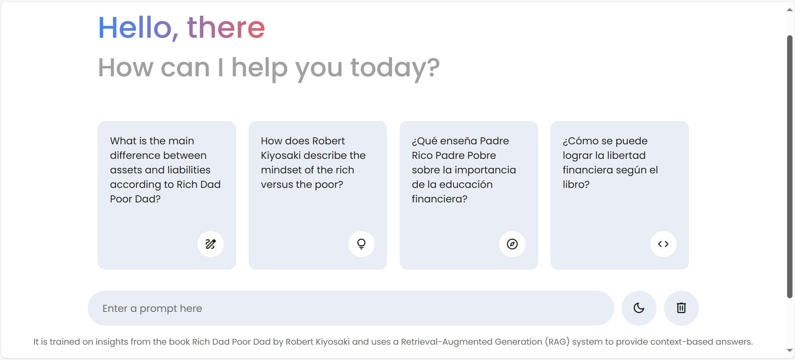

# Multilingual RAG Chatbot with Frontend

This project is a **Multilingual Retrieval-Augmented Generation (RAG)** chatbot that supports **English** and **Spanish** using a simple web-based frontend. The chatbot is powered by sentence-transformers' [`BAAI/bge-m3`](https://huggingface.co/BAAI/bge-m3) for multilingual embeddings and provides real-time answers from documents using a FastAPI backend.



## Features

- 🔤 **Multilingual support (English & Spanish)**
- 📚 Loads PDFs from `knowledge/` folder
- ⚙️ FastAPI backend for handling queries
- 🧠 Embedding via `BAAI/bge-m3`
- 💬 Interactive frontend chatbot UI
- 📦 Integration-ready for more languages & data sources

## Installation

1. **Clone the repository**

```bash
git clone https://github.com/badarkhannn/multilang-rag-with-frontend.git
cd multilang-rag-with-frontend
```

2. **Create a virtual environment and activate it**

```bash
# For Unix/Mac
python -m venv .venv
source .venv/bin/activate

# For Windows
python -m venv .venv
.venv\Scripts\activate
```

3. **Install dependencies**

```bash
uv pip install -r requirements.txt
```

## Running the Project

To start the FastAPI backend server:

```bash
cd backend
uvicorn server:app --reload
```

This will start the server at `http://127.0.0.1:8000`.

To access the chatbot UI, simply open the `frontend/index.html` file in a browser.

## Embedding Model

This project uses the [BAAI/bge-m3](https://huggingface.co/BAAI/bge-m3) model for creating multilingual embeddings from English and Spanish documents.

### 🔎 Chatbot Screenshot


## 🧠 Knowledge Base

- `Rich-Dad-Poor-Dad-en.pdf` (English)
- `Padre-rico-padre-pobre-n.pdf` (Spanish)

These files are stored in the `knowledge/` folder and are used to retrieve accurate answers in their respective languages.

## Contributing

If you’d like to contribute, feel free to fork the repo and open a pull request with your improvements!

## 📄 License

This project is open-source and available under the MIT License.

Made with ❤️ by [Badar Khan](https://www.linkedin.com/in/badarkhannn/)
